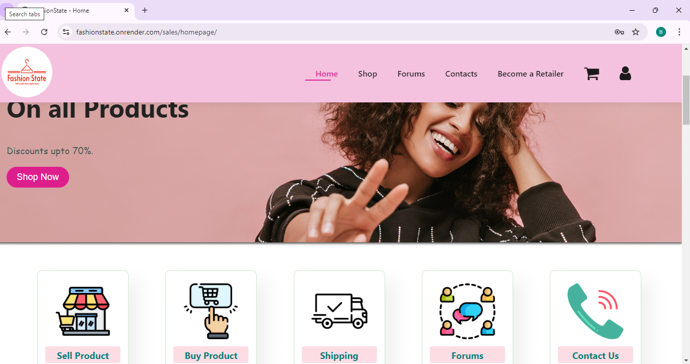
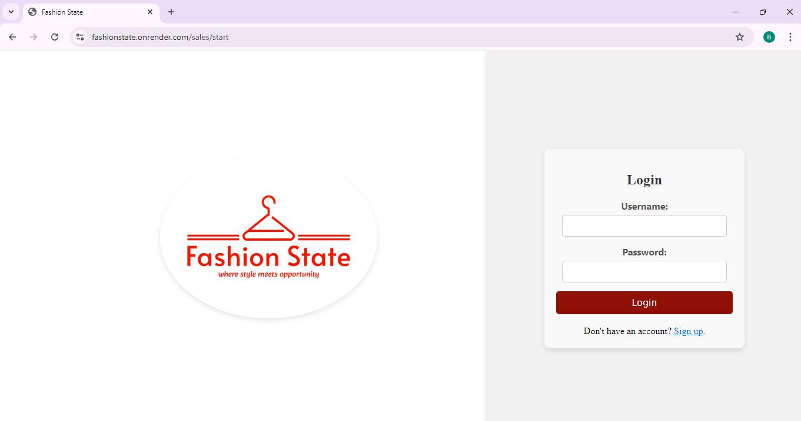
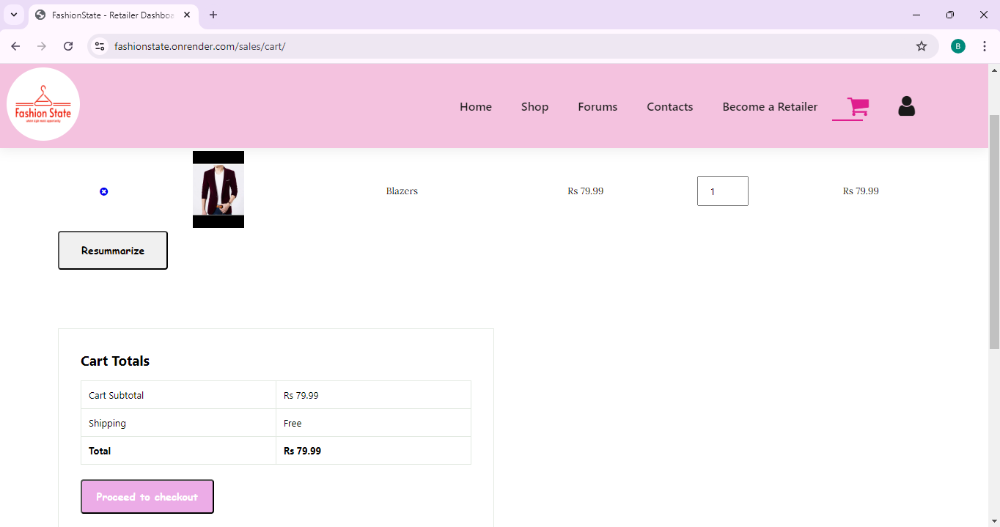
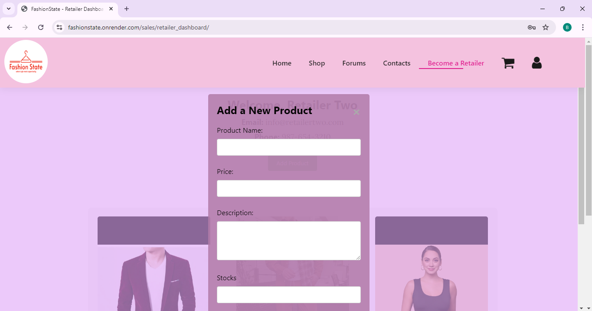

# FashionState

**BY (Bipul Kumar Dahal(THA078BEI009),Binita Adhikari(THA078BEI008),Nischal Bhusal(THA078BEI024))**

## Overview

FashionState is a web application that aims to revolutionize the way users explore, discover, and purchase fashion items. The platform offers personalized recommendations, trend analyses, and a seamless shopping experience tailored to individual style preferences.

## Features

1. **Personalized Fashion Recommendations**: Using AI algorithms, FashionState provides users with fashion recommendations based on their style preferences and browsing history.
2. **Trend Analysis**: Stay ahead of the curve with real-time fashion trend analyses.
3. **User Profiles**: Create a profile to save your favorite items, track your purchases, and receive personalized updates.
4. **Seamless Shopping Experience**: Browse and purchase fashion items directly through the platform with an integrated shopping cart and checkout system.
5. **Sell your products**: Create a retailer profile and sell your products online.

## Technologies used

1. **Frontend**: HTML,CSS,Javascript
2. **Backend**: Django
3. **Database Engine**:postgresql
4. **Database GUI**: PGAdmin
5. **Version Control**:Git,Github
6. **Cloud Hosting**: Githubpages(frontend),render.com(backend,database)

## Installations:

**Prerequisites**:

Before you begin, ensure you have the following installed on your system:
1. Python 3.8+
2. Django 3.2+
3. PostgreSQL

## Usage:

1. Register or log in to your account.
2. Browse through the fashion categories and products.
3. Receive personalized recommendations.
4. Add items to your shopping cart and proceed to checkout.
5. View and share your fashion preferences with friends.

## Live Demo

Check out the live version of FashionState: [Visit FashionState](https://fashionstate.onrender.com/sales/start)

## Screenshots

Here are some screenshots of the application:

### Homepage

### Login page

### Cart

### Retailer Section

### Contact

For questions or support, please reach out to dahalbipul999@gmail.com

